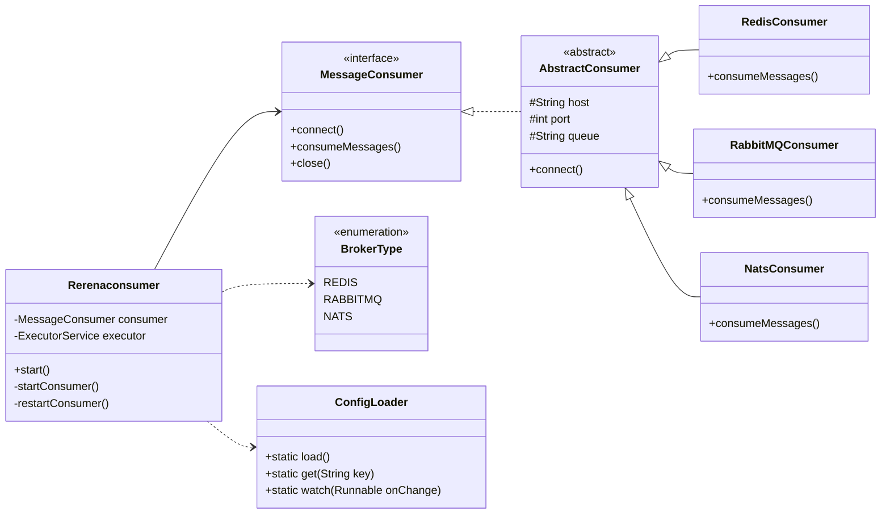
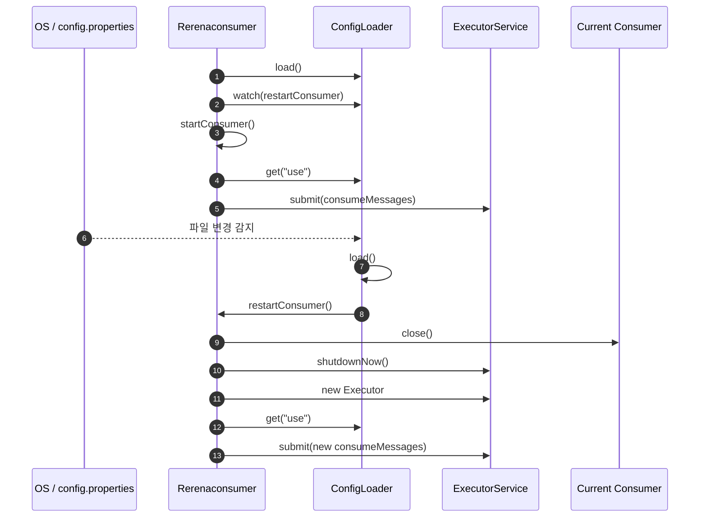

# 📝 메시징 브로커 핫 스와핑을 위한 자바 Consumer 아키텍처 분석

## Rerena 프로젝트

---

## 1. 개요 및 프로젝트 목표 (Introduction)

**Rerena 프로젝트**는 다양한 메시징 브로커(**Redis, RabbitMQ, NATS**)를 유연하게 지원하는 자바 Consumer 아키텍처입니다.
핵심 목표는 설정 파일(`config.properties`) 변경만으로 애플리케이션 재시작 없이 **메시징 브로커를 동적으로 전환(Hot Reloading)** 하는 것입니다.

본 글에서는 다음 두 관점에서 구조를 분석합니다.

* **정적 구조**: 클래스 및 책임 분리
* **동적 동작**: 설정 변경 시 Consumer 전환 흐름

모든 설명은 **Mermaid 다이어그램**을 기반으로 합니다.

---

## 2. 정적 구조 분석: 클래스 다이어그램

프로젝트는 **Interface → Abstract Class → Concrete Implementation** 구조를 사용하며, 이는 전형적인 **전략 패턴(Strategy Pattern)** 구현입니다.

### 2.1 클래스 다이어그램



### 2.2 핵심 설계 포인트

* **MessageConsumer 인터페이스**
  모든 브로커 Consumer는 동일한 생명주기(`connect → consume → close`)를 따릅니다.

* **전략 패턴 적용**
  런타임에 어떤 브로커를 사용할지는 `config.properties` 값에 의해 결정됩니다.

* **설정 중앙화**
  `ConfigLoader`를 통해 모든 Consumer가 동일한 설정 접근 방식을 사용합니다.

---

## 3. 동적 동작 분석: 시퀀스 다이어그램

아래는 설정 파일 변경 시 **Consumer가 안전하게 교체되는 전체 흐름**입니다.

### 3.1 핫 리로딩 시퀀스



### 3.2 동작 요약

1. 설정 파일 변경 감지 (`WatchService`)
2. 기존 Consumer 안전 종료
3. ExecutorService 재생성
4. 새로운 브로커 Consumer 즉시 실행

→ **무중단 브로커 전환 달성**

---

## 4. RerenaProducer의 역할

`RerenaProducer`는 Consumer와 달리 **단발성 메시지 전송**을 담당합니다.

* 설정 파일 직접 로드
* 특정 브로커로 메시지 전송
* Consumer 핫 스와핑 테스트 용도

운영 코드와 테스트 코드를 명확히 분리한 설계입니다.

---

## 5. 사용한 오픈소스 및 라이브러리 분석

Rerena 프로젝트는 표준 Java API와 여러 오픈소스 라이브러리를 기반으로 구성되어 있습니다. 각 오픈소스는 명확한 역할을 가지며, 핫 스와핑 아키텍처의 핵심을 담당합니다.

### 5.1 Java Standard Library (JDK)

#### java.util.concurrent (ExecutorService)

* **역할**: Consumer 메시지 수신을 비동기로 실행
* **선택 이유**: 스레드 생명주기 제어가 명확하며, Consumer 교체 시 안전한 종료가 가능

사용 기능:

* `ExecutorService.submit(Runnable)` : 메시지 소비 로직을 별도 스레드에서 실행
* `ExecutorService.shutdownNow()` : 핫 리로딩 시 기존 Consumer 즉시 중단
* `Executors.newSingleThreadExecutor()` : Consumer 1개당 1스레드 보장

---

#### java.nio.file.WatchService

* **역할**: `config.properties` 파일 변경 감지
* **선택 이유**: OS 레벨 파일 변경 이벤트 기반 → 폴링 대비 성능 우수

사용 기능:

* `FileSystems.getDefault().newWatchService()` : 감시 서비스 생성
* `Path.register()` : 특정 디렉토리 변경 이벤트 등록
* `WatchKey.pollEvents()` : 파일 수정 이벤트 감지

핫 리로딩의 핵심 트리거 역할을 수행합니다.

---

#### java.util.Properties

* **역할**: 설정 파일 로드 및 키-값 관리
* **선택 이유**: 단순한 설정 구조에 최적화된 표준 API

사용 기능:

* `Properties.load(InputStream)` : 설정 파일 로드
* `Properties.getProperty(String key)` : 설정 값 조회

---

### 5.2 메시징 브로커 클라이언트 라이브러리

> 실제 프로젝트에서는 아래 라이브러리 중 일부 또는 전부가 사용됩니다.

#### Redis (Jedis / Lettuce)

* **역할**: Redis Pub/Sub 기반 메시지 소비
* **기능**:

  * Redis 서버 연결 관리
  * 채널 구독 및 메시지 수신

#### RabbitMQ (amqp-client)

* **역할**: AMQP 기반 메시지 큐 소비
* **기능**:

  * Connection / Channel 관리
  * Queue 바인딩 및 메시지 Ack 처리

#### NATS (nats.java)

* **역할**: 경량 고성능 메시징 시스템
* **기능**:

  * Subject 구독
  * 비동기 메시지 수신 콜백 처리

모든 브로커 라이브러리는 **MessageConsumer 인터페이스 뒤에 캡슐화**되어 직접 의존성이 확산되지 않도록 설계되었습니다.

---

## 6. 주요 클래스 및 함수 단위 기능 설명

### 6.1 MessageConsumer (Interface)

```java
public interface MessageConsumer {
    void connect();
    void consumeMessages();
    void close();
}
```

* `connect()`
  브로커 서버와의 연결을 초기화합니다.

* `consumeMessages()`
  메시지를 지속적으로 수신하는 핵심 로직입니다. 일반적으로 **무한 루프 또는 브로커 콜백** 형태로 동작합니다.

* `close()`
  연결 종료 및 리소스 해제를 담당합니다. 핫 리로딩 시 반드시 호출됩니다.

---

### 6.2 AbstractConsumer (Abstract Class)

공통 설정 로직을 담당하는 템플릿 역할의 클래스입니다.

주요 책임:

* `ConfigLoader`를 통한 host, port, queue 로딩
* 브로커별 Consumer의 중복 코드 제거

```java
protected String host;
protected int port;
protected String queue;
```

* `connect()`
  공통 연결 로직 또는 연결 전 사전 처리 담당

---

### 6.3 RedisConsumer / RabbitMQConsumer / NatsConsumer

각 브로커에 특화된 메시지 소비 구현체입니다.

공통 특징:

* `consumeMessages()`에서 실제 브로커 API 호출
* 브로커별 예외 처리 및 재연결 전략 포함 가능

역할 분리 효과:

* 브로커 변경 시 기존 코드 수정 없음
* 신규 브로커 추가 시 클래스 1개만 확장

---

### 6.4 ConfigLoader

설정 관리의 단일 진입점(Single Source of Truth) 역할을 합니다.

주요 함수:

* `load()`
  `config.properties` 파일을 읽어 내부 `Properties` 객체를 갱신합니다.

* `get(String key)`
  Consumer 및 메인 서비스에서 설정 값을 조회합니다.

* `watch(Runnable onChange)`
  파일 변경 감지 스레드를 시작하고, 변경 시 콜백을 실행합니다.

→ **Observer 패턴의 성격을 일부 내포**한 구조입니다.

---

### 6.5 Rerenaconsumer (Main Service)

애플리케이션의 전체 생명주기를 제어하는 컨트롤 타워입니다.

주요 함수:

* `start()`
  애플리케이션 시작 지점. 설정 로드 및 감시 등록 수행

* `startConsumer()`
  설정 값에 따라 Consumer 생성 및 실행

* `restartConsumer()`
  핫 리로딩 시 호출되는 핵심 메서드

  * 기존 Consumer 종료
  * ExecutorService 재생성
  * 새로운 Consumer 실행

---

## 7. 결론 및 확장성

Rerena 프로젝트는 다음과 같은 특성을 갖습니다.

* 오픈소스 표준 API 중심의 안정적 설계
* 브로커 의존성 최소화
* 함수 단위 책임 분리로 유지보수성 극대화

Kafka, AWS SQS 등 신규 브로커 추가 시에도 **Consumer 구현체만 추가**하면 되므로 확장 비용이 매우 낮습니다.

이 구조는 실무 환경에서 **운영 안정성, 확장성, 테스트 용이성**을 동시에 만족시키는 메시징 Consumer 아키텍처의 모범 사례라 할 수 있습니다.
